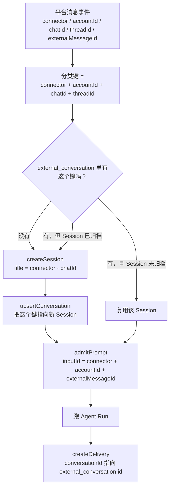

> 状态：当前 Bot/Channel 接入与运行时的权威流程。

# Channels 调用链

Channels 把飞书等聊天平台接到正在运行的 daemon。**渠道长连接、渠道配置与接入都由 daemon 拥有**；CLI 与 Desktop 只是客户端：

- `ohs channels add feishu`（扫码优先、可手填）与 Desktop 的「设置 → 连接」都调用 daemon 的 `/channels/feishu/*` 接口；
- `ohs channels serve` 只负责「让 daemon 启动渠道并跟随状态」，不再自己持有长连接；
- `ohs channels status` 读取 daemon 的渠道配置与运行时状态。

daemon 内部由两个服务承担：`ChannelRuntimeService`（长连接生命周期、ACL 拒绝上报、每会话工作目录）与 `ChannelOnboardingService`（唯一写 `channel-credentials.json` 的入口）。消息进入 Agent 的唯一正式桥接仍是 `DurableChannelBridge`，只是现在直接在 daemon 内调用 `ChannelApplicationService`，不再走 HTTP。

## 接入（扫码优先，手填兜底）

```bash
ohs channels add feishu
```

- 默认走**扫码创建应用**：终端显示二维码与授权链接，用飞书 App 扫码确认后，daemon 拿到新应用的 `appId`/`appSecret`。
- 也可选择**手填** `App ID` / `App Secret`，并选地区（国内 `feishu` / 国际 `lark`）；手填会**当场校验**（换 tenant access token），校验失败不写任何配置。
- 扫码路径默认把**扫码者本人**加入白名单；其他人或群用 `ohs channels allow <ou_...|oc_...>` 添加。
- 渠道配置与密钥统一写入默认 `~/.openharness-ts/channel-credentials.json`（受 `OPENHARNESS_CONFIG_DIR` 覆盖，v2，POSIX `0600`）；`settings.json` 不再承载 `channels`。
- Desktop 的「设置 → 连接」提供同样的扫码/手填、状态、白名单与启停能力。

## 一条消息实际怎么走

```text
飞书消息
  → daemon 内 FeishuAdapter 收到
  → ChannelManager 检查发送人或会话白名单
  → DurableChannelBridge 把消息交给 daemon 应用服务（进程内直调）
  → daemon 找到“外部聊天 -> Session”的数据库记录，没有就创建
  → 用平台 message_id 保存 Input，并创建或找到唯一 Run
  → Agent 完成后，daemon 保存准备发送的回复
  → ChannelManager 调飞书发送
  → daemon 保存 sent / failed / unknown
```

这里把“Agent 已经跑完”和“回复已经发到平台”分成了两件事。平台发送失败时，系统重发数据库里已经保存的回复，不会重新运行 Agent。

## 运行时生命周期

```text
daemon ready()
  → 后台启动所有 enabled 渠道（每渠道独立，失败只影响该渠道）
      - 缺 appId/appSecret 或缺 settings.model → 该渠道 state=error，附 lastError
      - 连接成功 → state=running；已建立的连接断开由飞书 SDK 自动重连
  → 配置变化：只有连接指纹（enabled/appId/appSecret/domain/replyAtBotNames）变化才重启连接；
    仅白名单或进度开关变化则原地生效，不重启

daemon close()
  → 先断渠道入站 → 有界等待在途消息 → 停止出站 → 再中断/排空 Run
  → 未发送回复保持 pending，下次启动由 recoverPending 恢复
```

- `enabled=true` 的渠道随 daemon 启动自动连接；`enabled=false` 持久化后重启也不连接。
- `ohs channels serve` 的 Ctrl+C 是**运行期临时停止**（不改配置）；重启 daemon 后 enabled 渠道会自动恢复。
- 同一 appId 只会有一条长连接：CLI 不再本地装配 adapter，长连接由 daemon 单点持有。

## 渠道会话的工作目录

渠道消息没有“当前项目”，所以每个外部会话使用专用工作目录：

```text
<OPENHARNESS_CHANNELS_DIR 或 ~/.openharness-ts/channels>/<connector>/<sanitize(chatId)>-<hash(会话键)>/
```

会话键与 Session 分类键一致（`connector + accountId + chatId + threadId`），hash 后缀避免不同会话落到同一目录；目录按需创建。

## 配置（含密钥）文件

```json
{
  "version": 2,
  "channels": {
    "feishu": {
      "enabled": true,
      "appId": "cli_...",
      "appSecret": "secret_...",
      "domain": "feishu",
      "allowFrom": {
        "个人": "ou_xxx",
        "工作群": "oc_xxx"
      },
      "replyAtBotNames": ["OpenHarness"],
      "sendProgress": true,
      "sendToolHints": true
    }
  }
}
```

`settings.json` 不再有 `channels` 字段，出现即报错（`SettingsFileError`）。`channel-credentials.json` 权限为 POSIX `0600`（Windows 依赖用户目录 ACL）。旧的 v1 凭据文件（只有 `appSecret`）会被当作“未配置渠道”，需要用 `ohs channels add feishu` 重新写入 v2。上面示例里的 `sendProgress` / `sendToolHints` 省略时默认按 `true` 处理。

`allowFrom` 为空时默认全部拒绝。白名单检查仍在 `ChannelManager`：**发送者或会话（群）任一命中即放行**，所以 `ou_...` 放行某个人、`oc_...` 放行某个群。未通过的消息不会进入 daemon，daemon 会记录最近拒绝并在 Desktop「连接」页提示，可用「加入白名单」直接放行。

## 外部聊天怎么绑定 Session

数据库保存一条 external conversation record，唯一键是：

```text
connector + accountId + chatId + threadId
```

- `connector` 是平台名，例如 `feishu`。
- `accountId` 是机器人账号；飞书当前使用 appId，避免同一平台的多个机器人串线。
- `chatId` 是群或私聊地址。
- `threadId` 是话题/回复串；没有时用空值。

同一个键一直找到同一个 durable Session，daemon 重启也不会丢。不同群、不同机器人账号或不同 thread 使用不同 Session。若原 Session 已归档，下一条消息会创建新 Session，并把原映射改到新 Session；历史 Session 不会被重新写入。

分类过程长这样：



一句话记住：**分类键决定 Session**（`connector + accountId + chatId + threadId`），**inputId 决定幂等**（`connector + accountId + externalMessageId`），**delivery 挂在该会话上**。飞书的 `accountId` 用的是 `appId`；`threadId` 为空串表示没有话题维度。

## 重复消息怎么处理

飞书可能重复推送同一条消息。系统用下面三项生成稳定 Input ID：

```text
connector + accountId + externalMessageId
```

同一个 ID、同一段正文再次到达时，daemon 返回原来的 Input、Run 和回复记录。两个同时到达的同一聊天消息也会串行准入，不会各自创建 Session 或 Run。

同一个 ID 如果带了不同正文，daemon 返回 409，并记录 `channel.message.idempotency_conflict` warning。系统不会猜哪一份正文才是真的。

## 回复状态

回复记录有四种状态：

| 状态 | 大白话含义 | 后续处理 |
|---|---|---|
| `pending` | Agent 已完成，还没开始发平台 | 启动时可以补发 |
| `sent` | 平台发送调用已成功 | 不再发送 |
| `failed` | 平台明确返回失败 | 可以重发同一份回复 |
| `unknown` | 已开始发送，但进程在确认结果前退出 | 不自动重发，避免平台其实已收到而产生重复消息 |

发送前先把状态写成 `unknown`，发送成功后改成 `sent`，明确失败后改成 `failed`。如果连“准备开始发送”这个状态都保存失败，本次不会调用平台发送。

## 权限和停机

Bot Run 使用 daemon 已有的权限系统。需要人工确认时，请求会出现在共用的 permission 状态里，TUI/Desktop 可以处理；通道接入层不再维护第二套自动放行名单。

daemon 收到关闭信号后：先停止渠道入站，最多等待在途消息一小段时间，然后停止渠道运行时，最后再中断/排空 Run。未发送的回复留在数据库里，下次启动补发；在途 Run 可能被中断，平台可能收不到这一次回复。

## 状态检查

```bash
ohs channels status
```

输出包括：

- 飞书是否配置/启用、白名单（为空即“全拒”）；
- 运行时状态（在线/连接中/已停止/失败）与 `lastError`；
- 机器人名称（取到时）；
- daemon 最近的外部聊天映射数量与回复状态。

Desktop 的「设置 → 连接」页展示同样的信息，并可启停、增删白名单、查看被拒提示。

## 相关命令

| 命令 | 作用 |
|---|---|
| `ohs channels add feishu` | 扫码/手填接入（委托 daemon），校验并写入凭据与配置 |
| `ohs channels allow <id> [--name <备注>]` | 把个人（`ou_`）或群（`oc_`）加入白名单，即时生效 |
| `ohs channels status` | 查看配置、白名单、运行时状态与最近回复 |
| `ohs channels serve` | 让 daemon 启动渠道并跟随状态，Ctrl+C 临时停止 |

## 代码位置

| 组件 | 位置 | 实际负责什么 |
|---|---|---|
| daemon 运行时 | `packages/server/src/daemon/channel-runtime-service.ts` | 每个 connector 的长连接生命周期、ACL 拒绝、每会话工作目录 |
| daemon 接入 | `packages/server/src/application/channel/channel-onboarding-service.ts` | 扫码/手填、校验、写配置、白名单（唯一写入者） |
| HTTP 路由 | `packages/server/src/http/routes/channel-control.ts` | `/channels/runtime/*`、`/channels/feishu/*` |
| CLI 入口 | `apps/cli/src/commands/channels.ts` | serve/status 委托 daemon |
| CLI 向导 | `apps/cli/src/commands/channels-onboarding.ts` | add/allow 的终端交互与委托 |
| 飞书接入核心 | `packages/channels/src/impl/feishu-registration.ts` | 包 `registerApp` 的扫码创建应用状态机 |
| 凭据校验 | `packages/channels/src/impl/feishu-verify.ts` | 换 tenant token 校验凭据，尽力取机器人信息 |
| 渠道配置存储 | `packages/auth/src/channel-config-store.ts` | 读写 `channel-credentials.json`（含渠道配置与密钥） |
| DurableChannelBridge | `packages/channels/src/core/durable-bridge.ts` | 把入站消息交给 daemon 应用，发布已保存回复 |
| ChannelManager | `packages/channels/src/core/manager.ts` | 白名单检查、平台收发、回写发送结果 |
| FeishuAdapter | `packages/channels/src/impl/feishu.ts` | 飞书 WebSocket、image/file 入站、thread/topic、真实 message ID 与出站发送 |
| 应用服务 | `packages/server/src/application/channel/channel-application-service.ts` | 映射 Session、幂等准入、等待 Run、保存回复 |
| Desktop 服务 | `apps/desktop/src/main/features/channels/channel-service.ts` | 经 daemon HTTP 调渠道接口、生成二维码、拒绝高水位 |
| Desktop 页面 | `apps/desktop/src/renderer/src/components/desktop/settings-page/connections-settings.tsx` | 「连接」板块：接入、状态、白名单、启停、被拒提示 |
| 工作目录根 | `packages/core/src/config/paths.ts` | `getChannelWorkspaceRoot()` |
| 数据库 | `packages/services/src/session-runtime/migrations/0000_current_schema.sql` | 当前数据库基线，包含聊天映射和回复状态 |

`FeishuPush` 工具仍是另一条主动推送捷径：它由当前 Agent 主动选择目标并发消息，不代表收到一条外部消息后的 durable 回复流程；它也在 daemon 进程内读取同一份渠道配置。
