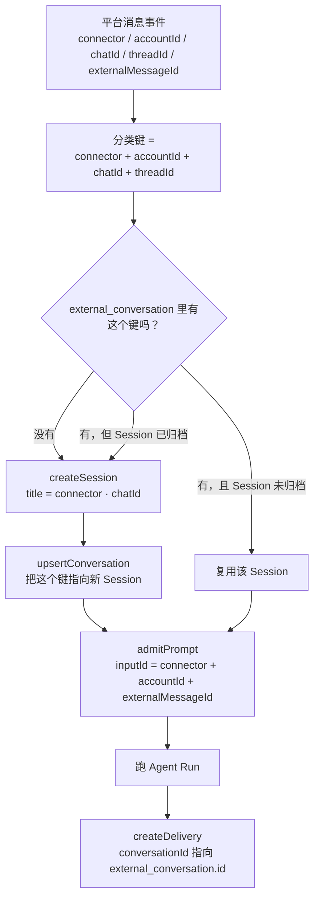

# Channels 调用链

> 状态：当前 Bot/Channel 接入 durable Application 的权威流程。

Channels 把飞书等聊天平台接到正在运行的 daemon。正式入口不会再自己创建一套 Agent；它和 CLI、TUI、Desktop 共用 daemon 里的 Session、Input、Run、权限请求和对话记录。

接入机器人先用 `ohs channels add feishu`（扫码优先、可手填），再用 `ohs channels serve` 长驻收发。`StdioAdapter` 和 `HttpAdapter` 是 adapter 实现；消息进入 Agent 的唯一正式桥接是 `DurableChannelBridge`，不再提供直连 standalone Agent 的临时 bridge。

## 接入（扫码优先，手填兜底）

```bash
ohs channels add feishu
```

- 默认走**扫码创建应用**：终端显示二维码与授权链接，用飞书 App 扫码确认后，SDK 直接返回新应用的 `appId`/`appSecret`。
- 也可选择**手填** `App ID` / `App Secret`，并选地区（国内 `feishu` / 国际 `lark`）。
- 两种方式都会**当场校验**（换 tenant access token）；校验失败不会写入任何配置。
- 渠道配置与密钥一起写入 `~/.openharness-ts/channel-credentials.json`（v2，POSIX `0600`）；`settings.json` 不再承载 `channels`。
- 扫码路径默认把**扫码者本人**加入白名单；其他人或群用 `ohs channels allow <ou_...|oc_...>` 添加（改完需重启 `ohs channels serve`）。

## 一条消息实际怎么走

```text
飞书消息
  -> ChannelManager 检查发送人或会话白名单
  -> DurableChannelBridge 把消息交给 daemon
  -> daemon 找到“外部聊天 -> Session”的数据库记录，没有就创建
  -> 用平台 message_id 保存 Input，并创建或找到唯一 Run
  -> Agent 完成后，daemon 保存准备发送的回复
  -> ChannelManager 调飞书发送
  -> daemon 保存 sent / failed / unknown
```

这里把“Agent 已经跑完”和“回复已经发到平台”分成了两件事。平台发送失败时，系统重发数据库里已经保存的回复，不会重新运行 Agent。

## 启动

```text
ohs channels serve
  -> 读取 channel-credentials.json 里的渠道配置
  -> 组装 FeishuAdapter 和白名单
  -> 连接已有 daemon；本机没有 daemon 时按 CLI 的统一规则启动
  -> 创建 MessageBus、ChannelManager、DurableChannelBridge
  -> 先补发 pending / failed 回复
  -> 连接飞书 WebSocket，开始处理新消息
```

`channels serve` 不直接创建 standalone Agent。它通过 `OpenHarnessClient` 调 daemon 的 `/channels/*` 接口，所以 Bot 创建的 Session 和 transcript 能被 TUI、Desktop 或其他客户端直接看到和继续使用。

渠道配置（含密钥）全部放在 `~/.openharness-ts/channel-credentials.json`（v2）：

```json
{
  "version": 2,
  "channels": {
    "feishu": {
      "enabled": true,
      "appId": "cli_...",
      "appSecret": "secret_...",
      "domain": "feishu",
      "allowFrom": {
        "个人": "ou_xxx",
        "工作群": "oc_xxx"
      },
      "replyAtBotNames": ["OpenHarness"],
      "sendProgress": true,
      "sendToolHints": true
    }
  }
}
```

`settings.json` 不再有 `channels` 字段，出现即报错（`SettingsFileError`）。`channel-credentials.json` 权限为 POSIX `0600`（Windows 依赖用户目录 ACL）。旧的 v1 凭据文件（只有 `appSecret`）会被当作“未配置渠道”，需要用 `ohs channels add feishu` 重新写入 v2。上面示例里的 `sendProgress` / `sendToolHints` 省略时默认按 `true` 处理。

`allowFrom` 为空时默认全部拒绝。白名单检查仍在 `ChannelManager`：**发送者或会话（群）任一命中即放行**，所以 `ou_...` 放行某个人、`oc_...` 放行某个群。未通过的消息不会进入 daemon。

## 外部聊天怎么绑定 Session

数据库保存一条 external conversation record，唯一键是：

```text
connector + accountId + chatId + threadId
```

- `connector` 是平台名，例如 `feishu`。
- `accountId` 是机器人账号；飞书当前使用 appId，避免同一平台的多个机器人串线。
- `chatId` 是群或私聊地址。
- `threadId` 是话题/回复串；没有时用空值。

同一个键一直找到同一个 durable Session，daemon 重启也不会丢。不同群、不同机器人账号或不同 thread 使用不同 Session。若原 Session 已归档，下一条消息会创建新 Session，并把原映射改到新 Session；历史 Session 不会被重新写入。

分类过程长这样：



一句话记住：**分类键决定 Session**（`connector + accountId + chatId + threadId`），**inputId 决定幂等**（`connector + accountId + externalMessageId`），**delivery 挂在该会话上**。飞书的 `accountId` 用的是 `appId`；`threadId` 为空串表示没有话题维度。

## 重复消息怎么处理

飞书可能重复推送同一条消息。系统用下面三项生成稳定 Input ID：

```text
connector + accountId + externalMessageId
```

同一个 ID、同一段正文再次到达时，daemon 返回原来的 Input、Run 和回复记录。两个同时到达的同一聊天消息也会串行准入，不会各自创建 Session 或 Run。

同一个 ID 如果带了不同正文，daemon 返回 409，并记录 `channel.message.idempotency_conflict` warning。系统不会猜哪一份正文才是真的。

## 回复状态

回复记录有四种状态：

| 状态 | 大白话含义 | 后续处理 |
|---|---|---|
| `pending` | Agent 已完成，还没开始发平台 | 启动时可以补发 |
| `sent` | 平台发送调用已成功 | 不再发送 |
| `failed` | 平台明确返回失败 | 可以重发同一份回复 |
| `unknown` | 已开始发送，但进程在确认结果前退出 | 不自动重发，避免平台其实已收到而产生重复消息 |

发送前先把状态写成 `unknown`，发送成功后改成 `sent`，明确失败后改成 `failed`。如果连“准备开始发送”这个状态都保存失败，本次不会调用平台发送。

## 权限和停机

Bot Run 使用 daemon 已有的权限系统。需要人工确认时，请求会出现在共用的 permission 状态里，TUI/Desktop 可以处理；通道接入层不再维护第二套自动放行名单。

第一次收到 SIGINT/SIGTERM 后，bridge 不再从入站队列取新消息，但会等待已经交给 daemon 的操作完成。它产生的回复仍有机会发送；随后 Manager 断开平台连接。即使停机发生在平台发送前，已完成 Run 和待发送回复仍在数据库中。

## 状态检查

```bash
ohs channels status
```

输出包括：

- 飞书是否启用以及白名单是否为空；
- daemon 是否可用；
- 最近的外部聊天映射数量；
- 最近回复的 `pending / sent / failed / unknown` 状态、chat 和 Run ID。

## 相关命令

| 命令 | 作用 |
|---|---|
| `ohs channels add feishu` | 扫码/手填接入，校验并写入凭据与配置 |
| `ohs channels allow <id> [--name <备注>]` | 把个人（`ou_`）或群（`oc_`）加入白名单 |
| `ohs channels status` | 查看启用状态、白名单与最近回复 |
| `ohs channels serve` | 长驻，连接平台并收发消息 |

## 代码位置

| 组件 | 位置 | 实际负责什么 |
|---|---|---|
| CLI 入口 | `apps/cli/src/commands/channels.ts` | 连接 daemon，组装和关闭通道 |
| 接入向导 | `apps/cli/src/commands/channels-onboarding.ts` | `add`/`allow`：扫码或手填、校验、写凭据与配置 |
| 飞书接入核心 | `packages/channels/src/impl/feishu-registration.ts` | 包 `registerApp` 的扫码创建应用状态机 |
| 凭据校验 | `packages/channels/src/impl/feishu-verify.ts` | 换 tenant token 校验凭据，尽力取机器人信息 |
| 渠道配置存储 | `packages/auth/src/channel-config-store.ts` | 读写 `channel-credentials.json`（含渠道配置与密钥） |
| DurableChannelBridge | `packages/channels/src/core/durable-bridge.ts` | 把入站消息交给 daemon，发布已保存回复 |
| ChannelManager | `packages/channels/src/core/manager.ts` | 白名单检查、平台收发、回写发送结果 |
| FeishuAdapter | `packages/channels/src/impl/feishu.ts` | 飞书 WebSocket、image/file 入站、thread/topic、真实 message ID 与出站发送 |
| 应用服务 | `packages/server/src/application/channel/channel-application-service.ts` | 映射 Session、幂等准入、等待 Run、保存回复 |
| HTTP 接入 | `packages/server/src/http/routes/channel.ts` | 把 `/channels/*` 请求转给应用服务 |
| 数据库 | `packages/services/src/session-runtime/migrations/0000_current_schema.sql` | 当前数据库基线，包含聊天映射和回复状态 |

`FeishuPush` 工具仍是另一条主动推送捷径：它由当前 Agent 主动选择目标并发消息，不代表收到一条外部消息后的 durable 回复流程。
