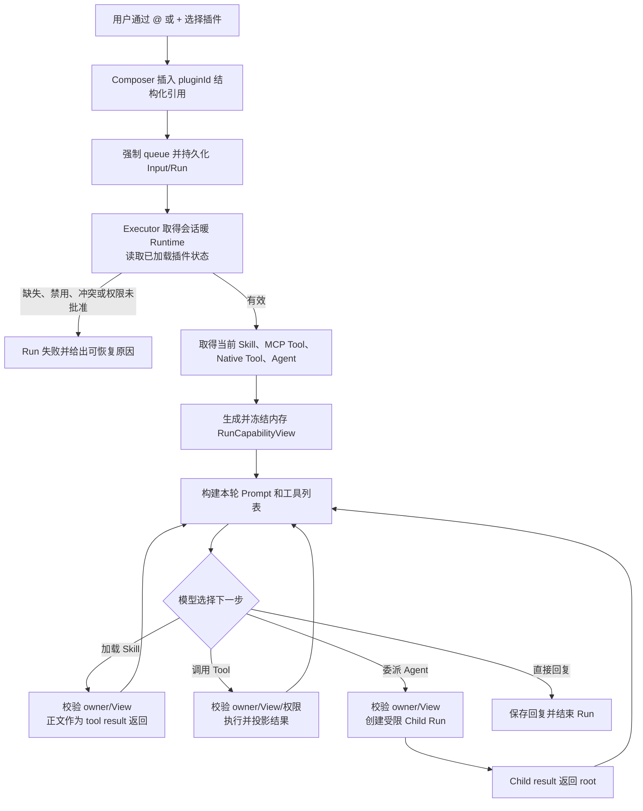

# 插件能力召唤与运行设计

> 状态：当前实现。Desktop 默认开放 `@/+` 插件选择；协议版本 3，服务能力 `pluginCapabilities: 1`。旧协议或缺少该能力时明确拒绝连接，Desktop 与 daemon 需要同时升级。不承诺插件执行环境精确重放。

## 1. 核心决定

插件是能力容器，不是一段预先拼好的 Prompt。用户选择 `@插件` 后，Input 只持久化 `pluginId` 和安全展示信息；Run 从当前会话暖 Runtime 已加载的插件状态生成只在内存中使用、运行期间冻结的 `RunCapabilityView`。

```text
用户选择 @插件
  → Input 保存 pluginId
  → Run 取得会话暖 Runtime
  → 读取 Runtime 已加载的 Skill、MCP、Native Tool、Agent
  → 生成内存 RunCapabilityView
  → 执行当前 Run
```

本设计接受以下产品语义：暖 Runtime 不会因为插件文件变化自动刷新。插件更新在插件管理触发 Runtime 失效、显式重载、应用重启或新会话创建 Runtime 后生效。OpenHarness 保证权限不扩大、运行期间不漂移和调用可追踪，不保证复现历史插件代码和工具 schema。

## 2. 调研结论

Codex 会先发现 Skill 元数据，再区分显式提及和实际注入的 Skill，并记录来源、插件 ID 与调用类型。Skill 正文不是所有已安装插件都永久进入系统提示词。

- [Codex skills.rs](https://github.com/openai/codex/blob/main/codex-rs/core/src/skills.rs)
- [Codex 仓库](https://github.com/openai/codex)

OpenAI 的模型工具接口把 MCP 和自定义函数作为工具 schema 提供给模型。模型选择工具后，宿主执行调用，再把结果作为 tool result 送回模型；工具定义和执行结果不是普通 Prompt 文本。

- [OpenAI Responses API：工具](https://developers.openai.com/api/reference/cli/resources/responses/methods/create)

WorkBuddy 将插件拆成 Skill、MCP、Hook、Agent 和 Rule。Skill 提供说明与工作流，MCP 提供外部工具，专家/Agent 提供独立角色。公开资料没有证明 WorkBuddy 桌面端固定使用 `@` 触发插件，本文只借鉴可核实的分层运行方式。

- [WorkBuddy 插件系统](https://www.workbuddy.cn/docs/workbuddy/Plugins)
- [WorkBuddy Skills](https://www.workbuddy.cn/docs/cli/skills)
- [WorkBuddy 连接器](https://open.workbuddy.cn/docs/connector)
- [WorkBuddy 专家](https://www.workbuddy.cn/docs/workbuddy/From-Beginner-to-Expert-Guide/Function-Description/Expert-Center)

## 3. 当前 OpenHarness 行为

`discoverOpenHarnessExtensions()` 当前会发现：

- `skillRegistry`：Skill 目录与元数据；
- `agentDefinitions`：插件 Agent 定义；
- `mcpServers`：插件 MCP Server 配置；
- `plugins`：已校验并加载的 Native Plugin；
- `warnings`：安装、完整性和组件诊断。

Runtime 创建时会连接适用的 MCP、激活插件 Native Tool 和 Hook，并装配 Agent Definition。当前 `$Skill` 采用结构化输入；服务端 `materializeSessionInput()` 重新校验 Skill，要求模型调用原生 `Skill` 工具，完整 `SKILL.md` 由该工具读取并作为 tool result 返回。详细流程见 [Skill Prompt Flow](./skill-prompt-flow.md)。

当前 `@/+` 只有文件、目标、计划模式和历史对话，没有插件引用。已启用插件能力主要在会话 Runtime 级装配，所以实现 `@插件` 的重点是按 Run 控制模型可见性和调用权限。

## 4. `@插件` 语义

选择 `@插件` 表示：

> 当前 Run 可以使用这个插件中当前已启用、已批准且适合当前环境的能力。

它不表示立即执行插件、调用全部 Tool、加载全部 Skill 正文、启动全部 Agent、永久固定到会话或扩大权限模式。

第一版的生效范围：

- 带插件引用的用户输入强制 `queue`，创建新 Run，不能 steer 到活动 Run；
- 插件能力只对该 Run 生效；
- Run 开始后 View 冻结；插件变化只有在插件管理触发 invalidation 并成功重建、显式重载、应用重启或新会话创建 Runtime 后，后续 Run 才生效；
- 后续无关消息不会从历史文本继承插件能力；
- Child Agent 只能继承父 Run View 的能力子集；
- Goal 自动续跑会复制 `pluginId`，每个 continuation Run 再读取插件当前有效状态。

## 5. 输入协议

```ts
type PluginCapabilityRef = {
  type: "capability"
  kind: "plugin"
  pluginId: string
  displayName: string
}

type PluginAgentRef = {
  type: "capability"
  kind: "plugin_agent"
  pluginId: string
  agentId: string
  displayName: string
}
```

`pluginId` 是持久身份，displayName 只用于恢复界面。客户端不提交绝对路径、MCP 启动配置、工具名单或权限数据。

服务端插件目录必须先为 pluginId 选出唯一有效安装：

- 只接受当前 discovery 认可的安装作用域；
- managed/user 同 ID 按插件安装层既有优先级选出唯一 winner；若无法唯一确定则不进入目录；
- Skill、MCP、Native Tool、Agent 必须保留 owner pluginId；
- 同名组件不能被裸名称合并静默改变所有权，冲突插件不进入 `@` 目录并显示诊断。

第一版每个 Input 最多选择一个 pluginId。同一个插件的 `@插件`、`$插件Skill` 和 PluginAgentRef 可以组合；不同插件组合明确拒绝并保留草稿。多插件运行另行设计。

## 6. RunCapabilityView

```ts
type RunCapabilityView = {
  pluginId?: string
  tools: ReadonlyMap<string, {
    ownerPluginId?: string
    serverId?: string
    definition: ToolDefinition
    invoke: ToolDefinition["execute"]
  }>
  skills: ReadonlyMap<string, {
    ownerPluginId?: string
    path: string
    definition: SkillDefinition
  }>
  mcpServers: ReadonlyMap<string, {
    ownerPluginId?: string
    serverId: string
    serverName: string
    definition: McpServerConfig
  }>
  agents: ReadonlyMap<string, {
    ownerPluginId?: string
    definition: AgentDefinition
  }>
}
```

View 是内存对象，不写数据库。Run 从当前会话暖 Runtime 已连接的 MCP、已激活 Native Tool、Skill Registry 和 Agent Definitions 解析本 Run 的 binding。Map、definition 和 owner 信息创建后使用只读封装及冻结副本，在这个 Run 中不再从全局 Registry 重新解析。

插件管理页面完成安装、更新、启用或禁用后，应沿用现有 Runtime invalidation 机制关闭相关暖 Runtime。linked plugin 被外部直接修改时不做每 Run 内容检测，需要显式重载、应用重启或新会话后生效。

过滤公式：

```text
当前 Run 可见能力
= 已通过 settings、host ceiling、deny list 和环境限制的非插件基线
+ 当前 pluginId 所拥有且已启用、已批准的插件能力
```

View 表示当前 Run 的完整有效能力集合：非插件内置工具、Settings MCP、普通用户/项目 Skill 和非插件 Agent 先按原规则加入，ownerPluginId 留空；再加入当前 pluginId 允许的插件 binding。View 只能进一步缩小能力，不能恢复被权限、环境或 host ceiling 禁止的能力。

工具是否出现在模型工具列表不是唯一保护。真正执行 Tool、加载 Skill 或创建 Child 前必须从当前 Run View 取得对应 binding，并再次检查 owner pluginId。Tool 调用使用 binding 保存的 definition/invoke，Skill 加载使用 binding 保存的路径与 definition，Child 创建使用 binding 保存的 Agent Definition；不能按名称回查可能已变化的全局 Registry。

## 7. 各组件运行方式

### 7.1 Skill

System Prompt 只列当前 Run 可见 Skill 的名称和描述。显式选择 Skill 后，materializer 在用户输入中加入加载要求；模型调用原生 `Skill` 工具后，正文作为 tool result 返回。

- `@插件` Run 可以发现该插件当前所有有效 Skill；
- `$插件Skill` 不要求再选一次 `@插件`，服务端从 Skill owner 推导同一 pluginId；
- 普通 Run 不自动发现插件 Skill；
- Skill Tool call 不能在 Run 中途增加另一个 pluginId；
- 当前 Skill 格式无法可靠声明工具依赖，因此 `$插件Skill` 会启用所属插件当前全部有效能力，产品文案应明确这一点。

### 7.2 MCP

MCP 启动配置不进入 Prompt。Runtime 可以继续按当前策略连接已启用服务器；discovery 为插件 MCP 生成唯一 server identity，并保留 tool → owner pluginId/server identity 映射。Run View 同时限制 MCP Server 和 Tool，只暴露 owner pluginId 匹配且 server identity 可见的 Tool schema。模型调用后，宿主重新检查 owner、server、View 和权限，再调用 MCP 并返回 tool result。

MCP 重连或暖 Runtime 重建后，后续 Run 使用 Runtime 当前 schema；活动 Run 使用创建 View 时捕获的 Tool binding 和 invoke target。连接断开时该 binding 调用明确失败，不切换到新定义，也不需要把旧 schema 持久化。

### 7.3 Native Tool

Native Tool 继续在受管 Tool Host 中激活。Run View 只决定当前模型能否看到和调用它，不为每个 Run 重启 Tool Host。

调用顺序：参数 schema 校验 → owner/View 检查 → 权限或用户批准 → Tool Host 调用 → 超时/中断处理 → 结果与产物投影。插件自身不能声明为 host-internal 工具，也不能绕过现有权限链。

### 7.4 Plugin Agent

Agent Definition 正文不进入主 Agent Prompt；父 Agent 只看到当前 View 允许的 Agent 名称和描述。PluginAgentRef 走现有 root 调用链：

```text
PluginAgentRef
  → 普通 root Input/Run
  → materializer 要求 root Agent 使用指定 Agent
  → root Agent 调 Agent Tool
  → Coordinator 创建 Child Run
  → Child result 返回 root Agent
  → root Agent 生成最终回复
```

用户单独选择 PluginAgentRef 时，服务端从 Agent owner 推导 pluginId。Child View 为父 View 与 Agent Definition tools/requiredMcpServers 的交集；requiredMcpServers 先按唯一 server identity 校验，再限制对应 Tool。Child 改 cwd 后也不能重新发现并扩大范围。Child 创建或执行失败记录在 Child Run，并作为失败 Tool result 返回 root。附件不自动继承。

### 7.5 Hook 和 Rule

Hook 当前随插件 Runtime 注册，由生命周期事件触发，不由 `@插件` 开关控制。Rule 是 WorkBuddy 的竞品概念，当前不是 OpenHarness Native Plugin 组件。二者不在第一版 `@插件` 范围。

## 8. Prompt 与工具边界

```text
System Prompt
  ├─ 产品、权限和模式规则
  ├─ Goal 等当前 Run 贡献
  └─ 当前 View 可见 Skill 的名称和描述

User Content
  ├─ 普通文本
  ├─ 文件/附件表示
  ├─ 插件引用的可读提示
  └─ 显式 Skill/Agent 的加载要求

Tools
  ├─ 非插件基线工具 schema
  ├─ 当前插件 MCP/Native Tool schema
  ├─ Skill Tool
  └─ Agent Tool

Tool Result
  ├─ SKILL.md 正文
  ├─ MCP/Native Tool 结果
  └─ Child Agent 结果
```

MCP 配置、缓存路径、凭证、Hook 实现和 Agent 正文不进入主 Agent Prompt。

## 9. 完整流程



## 10. Goal 与重试

Input 是 pluginId 的持久事实来源。相同 requestId 和相同输入重试复用原 Input/Run，不创建第二条记录。尚未开始的 Run 可以正常进入队列；一旦 Run 已开始，就不进行透明的整轮重放。恢复操作和 Goal continuation 创建新的 Run，并从当时的会话 Runtime 生成新的 View。

Goal 创建、编辑或显式恢复时，把当前 Input 的 pluginId 保存到 Goal revision。initial、resume 和 continuation Run 都携带该 pluginId，并在各自开始时从会话 Runtime 生成新的内存 View。插件管理正常更新并失效 Runtime 后，下一轮使用重建后的已批准版本；linked 目录外部修改不会自动刷新。新增权限没有获批时插件不会进入有效目录，Goal 暂停并提示用户处理。续跑不能从插件历史文本推断或增加另一个 pluginId。

本方案不追求同一 Run 重试时复现完全相同的插件代码或 schema。requestId 只保证 admission 幂等，toolCallId 也不保证跨整轮执行保持一致。若未来支持 replay，可能产生外部副作用的工具必须接受持久业务幂等键，或重新请求用户确认；不能自动重复已开始的 Run。

## 11. 权限和安全

- 安装/启用表示可以被发现，`@插件` 表示当前 Run 可以使用，不等于批准每个高风险操作。
- 新版本新增权限必须先经过现有插件更新授权；Run View 只能读取已经批准的权限。
- 文件写入、系统命令、网络、删除、发布、支付和外部消息继续走现有权限策略。
- Skill 内容、MCP 返回和网页数据都是不可信输入，不能覆盖系统和用户权限。
- Tool、Skill、Agent 的 owner pluginId 由服务端 discovery 产生，不能相信客户端字段。
- 选定插件的 Child 只能获得父 View 的子集。普通 Coordinator 的角色工具列表不构成宿主权限上限；没有 pluginId 时，Child 按自己的角色重建非插件基线，同时保留 hostToolCeiling、禁用工具和权限策略。
- 插件中途更新不改变活动 Run 的 View；只有 Runtime 被成功失效/重建、显式重载、应用重启或新会话后，后续 Run 才使用新状态。

## 12. 状态和展示

Composer 和历史消息显示插件名称，隐藏绝对路径、凭证和内部配置。解析失败保留草稿和插件引用；Run 开始后插件无效则显示具体失败原因，例如插件已禁用、权限待批准、组件冲突或 MCP 连接失败。

插件整体不使用伪造的单次 `running → completed` 状态。同一 Run 可以多次调用插件，具体执行继续使用现有 Tool/Child 消息。能力状态 presentation 只负责插件解析、等待授权和初始化失败，并携带 sessionId、runId 和 pluginId。

## 13. 分阶段交付

1. 插件 owner inventory、唯一 pluginId winner 和冲突诊断。
2. 输入协议、强制 queue、内存 RunCapabilityView 和调用前 guard。
3. 插件 Skill、MCP、Native Tool 的按 Run 可见性。
4. PluginAgentRef、Agent Tool 和 Child View 交集。
5. Goal pluginId 传播、Desktop `@/+`、历史恢复和 presentation。

完整 `@插件` 已默认开启。`VITE_PLUGIN_MENTIONS_ENABLED=false` 只用于关闭 Desktop 选择入口的回归验证，不关闭服务端的 View 过滤，也不绕过协议校验。第一版不实现多个插件、会话固定、插件参数表单、旧数据兼容或自动附件继承。

## 14. 验收

- `@/+` 展示同一插件目录，选择结果持久化 pluginId，不暴露内部路径。
- capability 输入不能 steer，失败保留草稿。
- managed/user 同 ID 有唯一 winner；组件冲突不能静默覆盖。
- 普通 Run → 插件 Run → 普通 Run 后无提示、Skill、Tool 或 Agent 泄漏。
- 活动 Run 中插件更新不改变 View；只有 Runtime 成功失效/重建、显式重载、应用重启或新会话后，后续 Run 才使用新版本。
- Tool、Skill 和 Agent 调用使用 View 中冻结的 resolved binding，不按名称重新读取全局 Registry。
- linked 目录外部修改不会自动刷新，显式重载、应用重启或新会话后生效。
- `$插件Skill` 推导所属 pluginId，正文只通过 Skill tool result 进入上下文。
- 未授权插件工具即使被直接构造 tool call 也会被拒绝。
- PluginAgentRef 通过 root Agent Tool 创建 Child，Child 改 cwd 不能扩大能力。
- Plugin Agent 的 requiredMcpServers 按唯一 MCP server identity 与父 View 取交集。
- `@插件` Goal 的每个 continuation Run 使用同一 pluginId 并重新生成当前 View。
- 插件新增权限未批准时不扩大能力，Goal 进入可解释暂停状态。
- 不同插件的组合输入明确拒绝；同一插件的 @、Skill、Agent 引用可以合并。
- 已开始 Run 不透明重放；恢复和 Goal continuation 使用新 Run。

## 15. 发布检查与手动验收

自动化组合覆盖普通→插件→普通、同插件引用合并、跨插件拒绝、Plugin Agent root→Child→root、Child 换目录、插件 Goal initial→continuation→complete、权限拒绝及数据库重开恢复。插件管理更新和 linked 外部修改通过实际 HTTP 重载、Tool Host 重建及 AgentPool 失效测试分层验证；尚未以真实 Electron 连到模型把整条管理更新链手动跑通。

本次未执行真实 Electron 手动验收。发版前按以下步骤确认，不能把自动化通过当作这些步骤已执行：

1. 在 `@` 和 `+` 中搜索同一插件，分别选择后发送；确认只显示名称，Esc、外部点击和再次点击 `+` 可以关闭列表。
2. 连续发送普通输入、`@插件`、普通输入，确认最后一轮不再出现插件 Skill、Tool 或 Agent。
3. 组合 `@插件 + $同插件Skill`；再混合两个插件，确认拒绝且草稿及引用保留。
4. 选择 Plugin Agent，确认 root 发起 Child、Child 换工作目录后仍受插件范围限制、结果返回 root。
5. 创建带插件的 Goal，观察 initial、continuation、完成；暂停后禁用插件再继续，确认出现可解释的暂停原因。
6. 拒绝一次高风险工具授权，确认插件代码没有执行；关闭运行错误后刷新，确认失败记录和插件名称恢复。
7. 运行中更新插件，确认当前 Run 继续使用旧绑定；下一次成功重建 Runtime 后才采用新版。linked 外部编辑后使用 `/reload-plugins` 再验证。
8. 将旧 daemon 与新 Desktop 连接，确认明确显示版本不匹配或需要同步升级，不静默隐藏插件入口。

`systemPromptForRun` 在有 View 时优先于 `setSystemPrompt()`；当前仓库没有生产代码调用该 setter。Context Usage 报告最近一轮实际采用的基础提示和单独的记忆后缀，普通 Run 会恢复基线提示。关闭错误仅改变组件显示，不改 durable Run 状态；重新打开历史仍会展示失败。

有 View 时 MCP 动态元工具当前拒绝执行；调用已冻结的具体 MCP 工具仍可用。暖 Runtime 不逐 Run 检测文件变化，不保存持久化 snapshot/resolution，不重放已开始的 Run。

## 16. 自动化验证记录（2026-09-14）

各 package 目录执行现有 `..\..\node_modules\.bin\vitest.CMD run`，最终 agent-runtime、server、Desktop 使用 `--maxWorkers=2`。这与这些 package 的 `test` 中 Vitest 部分相同；Desktop 额外执行了 update packaging 和 workspace boundaries 两项脚本，均通过。

| 范围 | 通过文件 | 通过用例 |
| --- | --- | --- |
| protocol | 7 | 56 |
| core | 21 | 166 |
| agent-runtime | 28 | 234 |
| services | 26 | 234 |
| server | 72 | 596 |
| client | 3 | 73 |
| Desktop | 141 | 873 |

后端全量在 `VITE_PLUGIN_MENTIONS_ENABLED=false` 环境执行；Desktop 另跑关闭入口的 5 文件专项，72 项通过，1 项默认开启显示用例跳过（已由正常全量覆盖）。

通过的脚本：`pnpm check-types`（61/61 tasks）、`pnpm --dir packages/agent-runtime test:pack`、`pnpm --dir apps/desktop build` 和 `node scripts/check-docs.mjs`（207 Markdown）。本机通过现有 pnpm 的 Node 入口调用上述脚本，未更改依赖。Desktop build 同时完成 node/web 类型检查及 main/preload/renderer 构建。

首次 Desktop 全量有三个并发负载下的超时，限制为 2 workers 后全量通过，未放宽超时。SDK/test:pack 的 node-pty 清理子进程打印 `AttachConsole failed`，测试和打包命令仍退出 0，对应工具运行、取消及清理断言均通过。构建仍有既有动态导入和测试文件路由提示。真实 Electron 手动步骤未执行。
