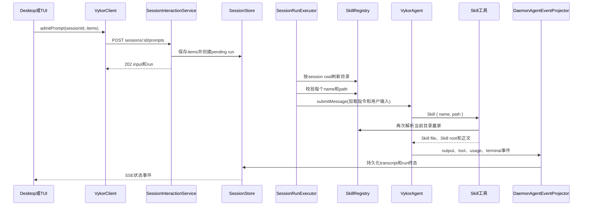

# Skill Prompt Flow

> 状态：当前结构化 Skill 输入从发送、校验、加载到 Run 收尾的权威流程。普通 prompt 主链见 [Daemon Application Architecture](./daemon-application-architecture.md#tui-发送-hi)，客户端收敛见 [Client Sync Flow](./client-sync-flow.md)。

## 边界

Skill 选择和 Skill 执行是两件事：

- Desktop 输入 `/` 或 `$` 选中 Skill 时，只向输入框插入结构化 Skill 引用；用户发送后才创建 prompt。
- TUI 输入 `/<skill> [args]` 并回车后，命令目录确认它是 `kind="template"`，随即提交同一种结构化输入。
- 客户端提交 Skill 的名称、当前 command catalog 给出的 `SKILL.md` 路径和展示快照，不提交 `SKILL.md` 正文。
- daemon 重新按 session cwd 发现 Skill，并验证客户端引用；真正的正文只由模型调用原生 `Skill` 工具时读取。

插件能力默认启用后，执行器从已加载的暖 Runtime 为每个 Run 创建内存 View（保存该轮可使用的具体能力）。`$插件Skill` 在准入时按服务端所有权目录推导 pluginId；与同插件的 `@` 或 Agent 引用合并，与其他插件组合则拒绝。

带 View 的 Run 在准备输入和执行 Skill 工具时都读取该 View 中捕获的 name/path/owner 与正文，不重新到全局目录寻找同名赢家。下面关于刷新目录的步骤仅适用于没有 View 的独立 Skill 调用。暖 Runtime 的文件变化需要插件管理失效、显式重载、重启或新会话才生效。

Slash 的三层分流和未知命令处理见 [Slash Command Flow](./slash-commands-flow.md)，输入框选择行为见 [输入框能力需求](./composer-capabilities-requirements.md)。

## 从发送到结束



### 1. 客户端提交结构化 items

Session prompt 使用普通 `POST /sessions/:sessionId/prompts`，没有单独的 Skill 执行接口。示例：

```ts
{
  id: "input-id",
  items: [
    {
      type: "skill",
      name: "archify",
      path: "D:/skills/archify/SKILL.md",
      displayName: "Archify",
      source: "project",
    },
    { type: "text", text: " 画一下系统架构" },
  ],
  delivery: "queue",
}
```

`items` 是持久化和恢复的事实来源，顺序也是用户表达顺序。`content` 是由 items 派生的纯文本，例如 `$archify 画一下系统架构`，用于 transcript、搜索和降级展示。附件仍是独立字段。

协议层会校验 item 类型、控制字符、字段长度、总文本字节数和最多 32 个 Skill。相邻 text item 会合并，空 text item 不保存。

### 2. durable admission 与排队

HTTP route 解析请求后调用 `SessionInteractionService.admitPrompt()`。它把准入交给 `RunAdmissionService`：后者通过 Conversation Transaction 原子保存 input 和 pending run，再交给 `SessionRunEngine` 持有的每 session 独占车道。HTTP 返回 `202` 只表示请求已经持久化并进入队列，不表示模型已经完成。

### 3. 执行前重新校验 Skill

轮到该 run 后，`SessionRunExecutor` 使用 session cwd 和当前 settings 重新执行扩展发现，取得当前 `SkillRegistry`。每个 Skill item 必须满足：

1. `path` 能在当前 registry 的目录赢家中解析；
2. 解析结果的 `name` 与 item 的 `name` 相同；
3. 同一路径只加载一次，多个不同 Skill 保留首次出现顺序。

任一引用不匹配时抛出 `session_input_skill_catalog_mismatch`。因此 renderer 携带的绝对路径只是待校验引用，不是任意文件读取授权。

### 4. materializer 生成本轮 Agent 输入

`session-input-materializer.ts` 不读取 `SKILL.md`，只把已经校验的 Skill 整理成一段明确的工具调用要求：

```text
用户显式选择了以下技能，请按出现顺序使用 Skill 工具的 { name, path } 加载并遵循：
1. archify (path: D:/skills/archify/SKILL.md)

用户输入：
$archify 画一下系统架构
```

如果 prompt 同时有附件，附件先按模型和工具能力路由为 `ContentBlock[]`，然后把上述前缀放进第一个文本块；没有文本块时会新增一个文本块。没有 Skill 或 conversation context 时，内容不改写。

### 5. 原生 Skill 工具读取正文

模型按指令调用 `Skill { name, path }`。工具会刷新文件系统 Skill registry，并同时校验：

- `path` 能解析到 Skill；
- 该结果与按 `name` 解析出的当前赢家是同一个定义。

成功后，工具返回：

- `Skill file`：可信的 `SKILL.md` 位置；
- `Skill root`：Skill 根目录；
- 相对路径应以 Skill root 为基准的说明；
- `<skill-content>` 中的 Markdown 正文；
- 当前执行环境的 shell/path 提醒。

如果没有显式 `path`，模型自行调用 Skill 时仍可只按 `name` 解析。显式用户选择始终传 `{ name, path }`，以便精确加载所选目录项。

### 6. transcript、SSE 与终态

用户消息的 text part 保存派生纯文本，并在 `metadata.items` 中保留原始结构化顺序。Desktop 根据这些 items 行内渲染 Skill 名称；绝对路径和 Skill 正文不显示。

之后完全回到普通 Run 主链：

1. Agent 的 input、output、tool、usage 和 terminal 事件进入 `DaemonAgentEventProjector`；
2. projector 持久化 message、part、run 和 attempt，并通过 SSE 发布；
3. 客户端 reducer 把 snapshot 和 SSE 收敛为界面状态；
4. terminal event 把 run 收束为 `completed`、`failed` 或 `interrupted`；
5. `run.result` settle 后，executor 才运行成功后的 maintenance，并处理 stale Agent。

终态和投影失败的硬规则见 [Agent Lifecycle Contract](./agent-lifecycle-contract.md)。

## 失败边界

| 阶段 | 失败行为 |
| --- | --- |
| 请求格式或 item 校验失败 | HTTP 返回协议校验错误，不创建可执行 run |
| Skill catalog 不可用 | run 失败，错误为 `session_input_skill_catalog_unavailable` |
| name/path 与当前目录不匹配 | run 失败，错误为 `session_input_skill_catalog_mismatch` |
| Skill 工具再次解析失败 | 工具返回 `Skill not found: <name>` 和 `isError: true` |
| Agent 或事件投影在 terminal 前失败 | executor 只为仍非 terminal 的 durable run 执行 infrastructure fallback |
| 客户端断线 | durable run 继续；客户端从最后 cursor 重连并回放 SSE |

## 代码入口

普通 Run 的系统提示只列非插件 Skill；选定插件后只加入该插件的 Skill 摘要，完整正文仍通过 `Skill` 的 tool result 进入上下文，MCP/Native Tool schema 只通过模型 tools 字段提供。Context Usage 使用最近实际发出的基础提示，避免把插件轮错误地统计为普通轮。`systemPromptForRun` 在有 View 时优先于 `setSystemPrompt()`；清空会话会清除最近 Run 的统计来源。

| 位置 | 职责 |
| --- | --- |
| `packages/protocol/src/session-input-items.ts` | `SessionUserInputItem`、校验、规范化和纯文本派生 |
| `apps/desktop/src/renderer/src/components/desktop/conversation-page/composer/` | Skill 选择、行内节点和 composer document |
| `apps/desktop/src/main/features/session/session-service.ts` | Desktop `sendPrompt({ items })` 转发 |
| `apps/frontend/src/hooks/useServerSync.ts` | TUI template 命令转成 Skill + text items |
| `packages/server/src/http/routes/run-execution.ts` | prompt HTTP 准入入口 |
| `packages/server/src/application/session/session-interaction-service.ts` | admission、live child 和幂等校验 |
| `packages/server/src/application/session/session-run-engine.ts` | durable input/run 与排队 |
| `packages/server/src/application/session/session-run-executor.ts` | catalog 校验、附件路由、materialize 和 Agent 提交 |
| `packages/server/src/application/session/session-input-materializer.ts` | Skill/context items 到本轮 Agent 输入 |
| `packages/tools/src/meta/skill.ts` | 按 name/path 读取可信 Skill、根目录和正文 |
| `packages/server/src/application/session/transcript-projection.ts` | 把 input items 投影到用户 text part metadata |
| `packages/server/src/application/agent/daemon-agent-event-projector.ts` | AgentEvent 到 durable state 和 SSE |
