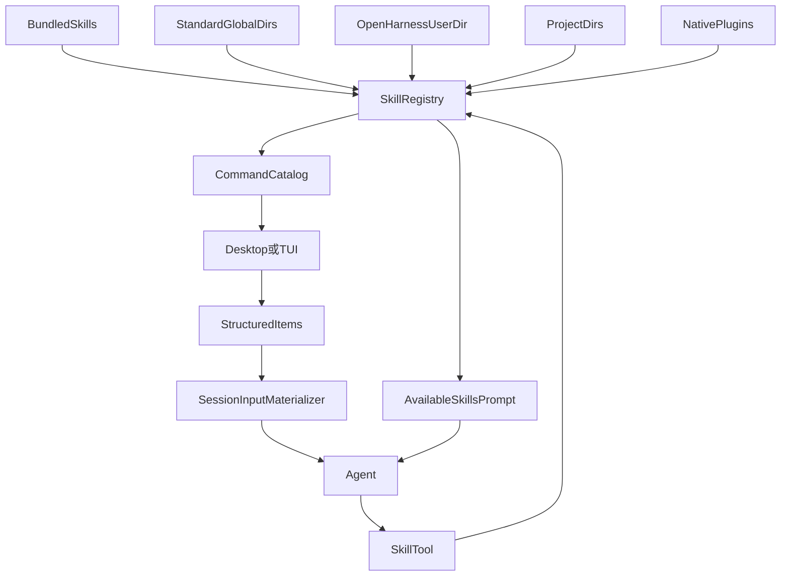

# Skills 加载与调用流程

> 状态：当前 Skill 发现、可见性、用户显式选择和模型按需调用的总览。结构化 Skill prompt 的执行细节见 [Skill Prompt Flow](./skill-prompt-flow.md)，斜杠命令分流见 [Slash Command Flow](./slash-commands-flow.md)。

Skill 是带 frontmatter 的 Markdown 方法论或提示词。运行时先把多来源 Skill 合并进一个 `SkillRegistry`，再提供给两类消费者：

1. 用户从 `/` 或 `$` 菜单显式选择有文件路径的 Skill，客户端提交结构化 Skill item；
2. 模型根据 system prompt 中的可用清单，自行调用 `Skill` 工具按需读取。

两条路径最终都由原生 `Skill` 工具读取正文；客户端、command catalog 和 system prompt 都不展开 `SKILL.md`。

## 涉及模块

| 组件 | 文件 | 职责 |
| --- | --- | --- |
| 输入协议 | `packages/protocol/src/session-input-items.ts` | 定义、校验和规范化 text/skill/mention/context items |
| Skill registry 与标准目录 | `packages/skills/src/index.ts` | frontmatter 解析、标准目录、按名称/路径解析、可见性和覆盖关系 |
| 扩展发现 | `packages/agent-runtime/src/extensions.ts` | 发现 bundled、用户、项目和 plugin 扩展，组装 registry |
| Command catalog | `packages/server/src/commands/default-command-catalog.ts` | 把 `userInvocable` Skill 暴露为 `kind="template"` |
| Desktop picker | `apps/desktop/src/renderer/src/components/desktop/conversation-page/composer/` | `/`、`$` 过滤与结构化 Skill 引用 |
| TUI template 提交 | `apps/frontend/src/hooks/useServerSync.ts` | 把 `/<skill> args` 转成 Skill + text items |
| 输入 materializer | `packages/server/src/application/session/session-input-materializer.ts` | 校验 catalog 引用并生成本轮 Skill 工具调用要求 |
| 原生工具 | `packages/tools/src/meta/skill.ts` | `Skill` 精确加载和 `ListSkills` 列举 |
| Runtime prompt | `packages/prompts/src/index.ts` | 向模型列出可见 Skill 的名称与描述 |

## 整体模型



同名 Skill 由 registry 的加载顺序决定当前赢家；项目中越接近 cwd 的目录优先级越高。Native Plugin 的 Skill 也进入同一个 registry，不建立第二套加载器。按 `path` 解析时只允许命中当前 registry 中的赢家。

## Frontmatter 与可见性

常用字段：

| 字段 | 默认值 | 作用 |
| --- | ---: | --- |
| `name` | 必填 | 稳定 Skill 名称，也是模型按名称加载的键 |
| `description` | 必填 | 菜单和 Available Skills 清单中的说明 |
| `user-invocable` | `true` | 是否进入用户 `/`、`$` Skill 目录 |
| `disable-model-invocation` | `false` | 是否从模型可见清单中排除 |
| `command-name` | `name` | 用户斜杠菜单中的命令名 |
| `display-name` | 派生名称 | UI 展示快照 |
| `argument-hint` | 无 | 菜单中的参数提示 |

两个开关相互独立：

| `userInvocable` | `disableModelInvocation` | 用户菜单 | 模型可见清单 |
| --- | --- | --- | --- |
| `true` | `false` | 有 | 有 |
| `true` | `true` | 有 | 无 |
| `false` | `false` | 无 | 有 |
| `false` | `true` | 无 | 无 |

`disableModelInvocation` 控制主动发现，不把 Skill 正文注入 system prompt。用户显式选中的 Skill 即使对模型隐藏，仍通过结构化 item 明确要求模型调用工具。

内嵌 bundled Skill 当前没有文件 path。Desktop 会过滤这类 template，TUI 即使提交也无法通过执行前的 path 校验，因此 bundled 当前只应视为模型按名称调用的能力；`userInvocable` 元数据不等于它已经具备可用的结构化用户入口。

## 用户显式选择路径

### Desktop

1. Desktop 用当前项目 cwd 请求 `GET /commands?cwd=...`。
2. `kind="template"` 的条目进入 Skill picker；条目包含 `skillName`、catalog `path`、说明和来源。
3. 用户从 `/` 或 `$` 选择后，编辑器插入 `SkillMentionNode`，不立即发送。
4. 发送时，composer document 按原顺序序列化为 `SessionUserInputItem[]`。
5. `sendPrompt({ items })` 进入普通 session prompt API。

同一个 Skill 可以出现多次；编辑器保留每次出现和原始顺序。服务端生成加载列表时按规范化路径去重。

### TUI

1. `parseSlashLine()` 解析 `/<skill> [args]`。
2. 本地 UI 和 shared session command 均未处理后，查 command catalog。
3. 命中 `kind="template"` 时，立即提交一个 Skill item，参数作为后续 text item。
4. 未知 slash 失败关闭，不作为普通 prompt 发送。

Builtin session command 与 Skill command 重名时，builtin 胜出。例如 `/commit` 走 git session 命令，不作为 template；模型仍可通过 `Skill` 工具加载同名 Skill。

### 服务端执行

daemon 持久化 items，并在 run 执行前用当前 session cwd 的 registry 校验每个 `{ name, path }`。materializer 只生成工具调用要求，不读取正文。模型随后调用：

```ts
Skill({ name: "archify", path: "D:/skills/archify/SKILL.md" })
```

完整 admission、校验、附件组合、transcript 和终态见 [Skill Prompt Flow](./skill-prompt-flow.md)。

## 模型按需调用路径

Runtime system prompt 只列出允许模型发现的 Skill 名称与描述。模型认为某项 Skill 适用时，可以只按名称调用：

```ts
Skill({ name: "debug" })
```

原生工具在调用时刷新文件系统 registry。没有 `path` 时按名称取得当前赢家；有 `path` 时，该路径必须解析到同一个按名称赢家，否则返回 `Skill not found`。

成功结果包含：

```text
Skill: archify
Skill file: D:/skills/archify/SKILL.md
Skill root: D:/skills/archify

Resolve relative paths mentioned by this skill against Skill root.

<skill-content>
...
</skill-content>
```

Skill 引用的 `scripts/`、`references/`、`assets/` 等相对路径以 `Skill root` 为基准。执行环境无法挂载该路径时，工具会明确提示 supporting files unavailable，而不是把宿主路径当作可直接读取的运行时路径。

## `/skills`、`ListSkills` 与 `Skill`

| 入口 | 做什么 | 是否读取正文 |
| --- | --- | --- |
| `/skills` | 共享 session 命令，列出或查看 Skill | 查看单项时可以读取 |
| `ListSkills` 工具 | 按 `model`、`user` 或 `all` 可见性列目录 | 否 |
| `Skill` 工具 | 按 name 和可选 path 加载当前定义 | 是 |
| `/<skill> args` | 用户显式提交结构化 Skill prompt | catalog 不读；工具执行时读 |

## 安全与一致性

- 客户端路径是 catalog 引用，不是文件读取授权；daemon 和 `Skill` 工具都会重新验证。
- catalog、materializer 和工具使用同一套 registry 发现规则，避免选择与执行解析到不同定义。
- 用户消息保存 `metadata.items` 作为展示依据，但 UI 不显示绝对路径和 Skill 正文。
- Skill 正文不进入 command catalog、用户 prompt 存储或 system prompt，只存在于原生工具结果。
- 文件系统 Skill 在工具调用时刷新，因此执行使用当前内容，不承诺选择时的历史快照。

## 历史演进

daemon 化前，REPL 曾在匹配 `/<skill>` 后把 `skill.content` 直接拼进 prompt。2026-08-31 的中间版本改用单数 metadata；2026-09-10 起统一为可保序、可包含多个 Skill 的 `SessionUserInputItem[]`。旧 REPL/BackendHost 和单数 metadata 均不是当前协议。
