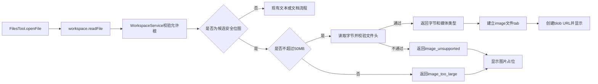

# 文件 tab 图片预览设计

> 状态：已实现（2026-09-13）。

## 实现结果与验证证据

- `workspace.readFile` 已支持 PNG、JPEG、GIF、WebP、BMP 和 AVIF；Main 先校验允许根、50 MB 压缩体积、真实文件头和尺寸/像素预算，再返回精确图片字节。
- 文件 tab 已增加 `image` 类型和专用图片组件，使用 `blob:` URL 完整居中显示；图片输入变化、解码失败和组件卸载都会撤销 URL。
- SVG、ICO、伪装内容、普通二进制和文档仍不进入图片渲染；文本 1.25 MB 上限与对话附件 10 MB 缩略图上限保持不变。
- Desktop 定向测试：9 个文件、77 个测试通过。
- Desktop 完整测试及打包/依赖边界检查：137 个文件、847 个测试通过。
- Desktop Node 类型检查：通过。
- 本功能改动文件 ESLint：0 error。`workspace-service.test.ts` 曾有 1 个既有格式 warning，已一并修正。
- `typecheck:web` 当前被并行开发中的 plugin capability 类型改动阻塞，5 个错误位于 composer、message 和 store 文件，不在本功能改动范围内；图片预览相关文件没有 IDE 类型诊断。
- 为避免干扰当前工作区正在进行的其他需求，本轮未启动 Electron 开发进程做人工界面验收。

## 背景

Desktop 右侧 Files 工具已经能从文件树、已编辑文件入口和恢复的标签页打开文件。入口是 `FilesTool.openFile`：Renderer 调用 `workspace.readFile`，Electron Main 的 `WorkspaceService` 在允许根内解析路径并读取文件，Renderer 再把返回结果放进文件 tab。

目前这条链只携带文本。`WorkspaceService.readFile` 会检查文件前 8,000 字节，只要包含 `0x00` 就把文件标成 `binary: true`，同时返回 `content: null`。PNG、JPEG、GIF、WebP、BMP、AVIF 等位图因此会在 `toFileViewerTab` 中归为 `document`，最后由 `FileViewer` 显示“这类文件的预览后续接入”占位。文件树已经能显示图片图标，但文件 tab 没有图片渲染分支。

对话附件已有一条安全图片缩略图链：Main 限制媒体类型、校验真实文件头，Renderer 根据返回字节创建 `blob:` URL。文件 tab 应沿用相同安全规则，但不能复用面向 80–96 px 附件卡片的 UI。

## 目标

- 在右侧文件 tab 中直接预览项目内和已允许 extra-root 范围内的安全位图。
- 支持 PNG、JPEG、GIF、WebP、BMP 和 AVIF，扩展名包括 `.png`、`.jpeg`、`.jpg`、`.gif`、`.webp`、`.bmp`、`.avif`。
- 单张图片最大预览大小为 50 MB，即 `50 * 1024 * 1024` 字节。
- Main 负责路径授权、压缩体积限制、媒体类型判断、真实文件头校验和像素预算；Renderer 只渲染 Main 已确认的字节。
- 文件 tab、活动路径、标签恢复和 extra-root 行为保持现有模式，不建立第二套标签状态。
- 图片无法预览时显示明确、稳定的占位，不白屏，也不影响其他文件 tab。

## 非目标

- 不预览 SVG。SVG 继续按文本源码处理，不能进入 ``、iframe 或 webview。
- 不预览 ICO、PDF、Word、Excel、PowerPoint、音频、视频或其他二进制格式。
- 不提供缩放、旋转、拖拽平移、像素信息、棋盘格切换或另存为操作。
- 不在 Review 工具中实现图片 diff。
- 不通过 `file://`、远程 HTTP(S) URL 或 base64 data URL 加载图片。
- 不新增图片专用 IPC；继续使用 `workspace.readFile`。
- 不改变对话附件缩略图的 10 MB 上限。
- 不改变文本文件现有的 1.25 MB 读取上限和源码渲染策略。

## 方案比较

### 方案 A：扩展 `workspace.readFile` 返回安全图片字节

Main 继续完成现有路径授权，然后按扩展名识别候选位图、检查 50 MB 上限、读取字节并校验文件头。通过后在现有结果中返回 `ArrayBuffer` 和媒体类型；Renderer 创建 `blob:` URL。

优点是复用现有打开、恢复、错误处理和 tab 状态，安全判断仍集中在 Main。`ArrayBuffer` 可由 Electron IPC 的结构化克隆直接传递，不需要 base64 带来的约三分之一额外体积。采用此方案。

### 方案 B：新增图片预览 IPC

文本先由 `workspace.readFile` 判为文档，Renderer 再发第二次请求取图。它会产生两次读取、两套加载状态和一次额外竞态，恢复 tab 时也更复杂，没有提供新的安全边界，因此不采用。

### 方案 C：把本地路径交给 ``

让 Renderer 使用 `file://` 最省代码，但会把绝对路径放进 DOM，并扩大特权 Renderer 可读取的本地资源范围；当前内容安全策略也没有允许 `file:` 图片源。因此不采用。

## 运行流程



具体步骤如下：

1. 文件树点击、恢复标签页或其他 `openFile` 请求继续进入 `FilesTool.openFile`。
2. `WorkspaceService` 继续通过 `resolveAllowedFile` 解析真实路径，并确认文件仍位于当前项目或允许的 extra-root 内。
3. Main 根据小写扩展名判断它是不是候选安全位图。
4. 非候选图片完全走现有文本流程：超过 1.25 MB 直接返回二进制占位；否则读取内容并执行现有二进制探测。
5. 候选图片先检查 `stat.size`。大于 50 MB 时不读取文件字节，返回图片过大状态。
6. 不超过 50 MB 时读取完整字节，根据候选扩展名得到预期媒体类型，并校验真实文件头。校验失败时不返回字节。
7. 校验通过后，Main 返回精确长度的 `ArrayBuffer` 和媒体类型。Renderer 把结果分类成 `image` tab。
8. 图片组件用字节和媒体类型创建 `Blob`，再通过 `URL.createObjectURL` 得到只在当前 Renderer 有效的 URL。
9. 切换文件不会销毁已打开 tab 的数据；关闭 tab、项目切换或 Files 工具卸载导致对应图片组件卸载时，撤销它创建的 URL。
10. 标签页持久化仍只保存路径。应用恢复标签时重新调用 `workspace.readFile`，不把图片字节写入 localStorage。

## 数据契约

`WorkspaceReadFileResult` 增加下列必填字段：

```ts
type WorkspaceImagePreviewError = "image_too_large" | "image_unsupported"

interface WorkspaceReadFileResult {
  // 现有字段保持不变
  previewBytes: ArrayBuffer | null
  mediaType: string | null
  imagePreviewError: WorkspaceImagePreviewError | null
}
```

字段组合必须满足：

| 结果 | `previewBytes` | `mediaType` | `imagePreviewError` | `content` |
|---|---:|---:|---:|---:|
| 安全图片 | 非空 | 安全图片 MIME | `null` | `null` |
| 压缩体积超过 50 MB，或宽高/帧数/总像素超过预览预算 | `null` | 由扩展名确定的 MIME | `image_too_large` | `null` |
| 图片头不匹配，或无法解析出可信尺寸 | `null` | `null` | `image_unsupported` | `null` |
| 文本或普通二进制 | `null` | `null` | `null` | 保持现状 |

这里增加 `imagePreviewError`，而不是让 Renderer 根据扩展名和大小重复推断失败原因。这样大小与安全策略只由 Main 决定，Renderer 只把明确状态映射成文案。

图片结果继续设置 `binary: true`。`binary` 表示它不是文本，不代表它一定不能预览。`toFileViewerTab` 的分类优先级调整为：

1. `previewBytes` 和 `mediaType` 都存在：`image`；
2. Markdown 路径：`markdown`；
3. `binary`、`content === null` 或现有文档扩展名：`document`；
4. 其他：`code`。

不允许只返回 `previewBytes` 或只返回 `mediaType`。这类内部不一致结果必须按文档占位处理，不能猜测 MIME。

## 大小与内存

“50 MB”在代码中固定表示 `50 * 1024 * 1024` 字节，只限制压缩后的文件体积。边界规则是：

- 等于 50 MB：允许继续做文件头和尺寸检查；
- 大于 50 MB：不读取字节，不通过 IPC 传输；
- 文件在 `stat` 后、读取前发生变化并增长：读取结束后再次检查实际字节长度；超过 50 MB 时丢弃字节并返回 `image_too_large`。

仅限制压缩体积不够。合法 PNG/JPEG/GIF/WebP/BMP/AVIF 可以在远小于 50 MB 的体积内声明数 GB 像素。Main 必须在把字节交给 Renderer 之前解析尺寸元数据，并按下面的预览预算拒绝：

- 单边最长 `8192` 像素；
- 总像素 `width * height * frames` 不超过 `16_777_216`（约 4096×4096 或 8192×2048 的单帧）；
- 动画最多 `64` 帧；
- 解析失败视为不可信，返回 `image_unsupported`，不得把无法确认尺寸的文件交给 ``。

按每像素 4 字节 RGBA 估算，上述像素预算对应约 64 MiB 解码上限。`` 的 `error` 回调发生在浏览器尝试分配和解码之后，不能当作防护。

文本上限仍是 `1_250_000` 字节。Main 必须先按候选图片与否选择大小门，不能让 1.25 MB 的文本门提前拒绝合法图片。

首版不增加图片字节缓存或 tab 淘汰策略，也不先生成受限缩略图。每个已加载图片 tab 会持有 IPC 返回的 `ArrayBuffer`，活动图片组件还会持有对应的 `Blob`。50 MB 是单文件压缩体积上限，不是所有 tab 的总预算；像素预算才是单张图的解码内存门。后续若实际数据表明多图片 tab 占用过高，再单独设计按 tab 释放与重新读取机制。

## 安全边界

### 路径授权

所有图片必须先通过现有 `resolveAllowedFile` 与 `realpath` 检查。项目内和 extra-root 使用同一规则；Renderer 不能传入任意绝对路径绕过允许根。

### 格式识别

扩展名只用于选择候选格式与预期 MIME，不构成最终信任。Main 必须验证：

- PNG：完整 PNG 签名字节；
- JPEG：`FF D8 FF`；
- GIF：`GIF87a` 或 `GIF89a`；
- WebP：`RIFF` 与偏移 8 的 `WEBP`；
- BMP：`BM`；
- AVIF：`ftyp` 且品牌为 `avif` 或 `avis`。

校验逻辑从 `attachment-service.ts` 抽成 `apps/desktop/src/shared/safe-image-preview.ts` 一类不依赖 Electron、Node 文件系统或 DOM 的纯函数。附件服务和 Workspace 服务共用它，避免两套允许列表、文件头或像素预算规则漂移。

签名通过后，Main 在把字节交给 Renderer 之前解析尺寸。PNG、JPEG、WebP、AVIF 走已有依赖 `sharp.metadata()`，只读元数据，不解码像素。当前 Desktop 自带的 libvips 没有 BMP 输入，且 GIF 的 `metadata()` 会忽略逻辑屏幕、把多帧叠成一条高图，所以这两种格式继续读文件头：GIF 用逻辑屏幕和图像描述符帧数，BMP 用 DIB 宽高。读不到可信尺寸就失败关闭。

SVG 即使扩展名正确也不在允许列表中。HTML 或脚本内容改名为 `.png` 时必须因文件头不匹配而返回 `image_unsupported`，不得创建 `Blob` URL。压缩后很小但声明 32768×32768 一类像素的合法文件，必须返回 `image_too_large`，不得进入解码。

### Renderer

Renderer 只用 Main 返回的精确字节和 MIME 创建 `Blob`。图片 `src` 只能是组件自己创建的 `blob:` URL，不使用本地路径。现有 CSP 已允许 `img-src 'self' data: blob:` 且未允许远程 HTTP(S) 图片，本功能不修改 CSP。

图片使用原生 ``，不插入文件内容到 HTML，不使用 `dangerouslySetInnerHTML`、iframe 或 webview。文件名只进入 React 文本和 `alt` 属性，沿用 React 转义。

## 组件边界

### `WorkspaceService`

负责：

- 路径授权和真实路径复核；
- 区分候选安全位图与普通文件；
- 应用 50 MB 压缩体积门或现有 1.25 MB 文本门；
- 读取图片、校验文件头，并按尺寸/帧数/像素预算拒绝超限文件；
- 构造互相一致的结果字段。

它不创建 URL，不保存 tab 状态，不决定图片布局。

### 共享安全图片模块

`apps/desktop/src/shared/safe-image-preview.ts` 只放渲染进程也能安全导入的纯函数：扩展名映射、魔数校验、像素预算判定。它不导入 `sharp`。

尺寸探测放在 Main 的 `inspect-safe-image-layout.ts`：先校验魔数，再对 PNG/JPEG/WebP/AVIF 调用 `sharp.metadata()`，对 GIF/BMP 读文件头。Workspace 和附件预览都走这一层，再把布局交给共享预算函数。附件服务现有的 10 MB 下载门仍留在附件服务内。

### `FilesTool`

继续负责打开请求、loading 状态、活动路径和 tab 恢复。`toFileViewerTab` 只根据 Main 的结果分类，新增 `image` 类型，不自行读取图片或判断文件头。

图片没有文本 `content`，所以：

- 不显示 Markdown 源码/预览切换按钮；
- `Ctrl+F` 不打开文件内搜索；
- 现有搜索控件保持禁用。

### `FileViewer`

新增专用 `ImagePreview`，负责：

- 根据字节与媒体类型创建和撤销 `blob:` URL；
- 在整个文件预览区域内居中展示图片；
- 使用 `max-width: 100%`、`max-height: 100%` 和 `object-contain` 保持比例，不裁剪；
- 使用现有 muted 背景，使透明图片边界可见；
- `` 解码失败后撤销 URL，并切换到失败占位。

该组件不复用 `AttachmentImagePreview`，因为附件组件的固定缩略图尺寸、裁剪方式和悬浮操作都不适合整栏文件查看。

## 展示与错误处理

图片成功时只显示图片本身；文件名继续由顶部 tab 和面包屑展示。首版不增加图片内部工具栏。

失败状态：

| 情况 | 展示 |
|---|---|
| 压缩体积超过 50 MB，或像素/帧数超过预览预算 | 标题为文件名，说明“图片太大，无法直接预览。” |
| 扩展名受支持但文件头不匹配 | 使用现有文档占位，说明“无法安全预览这张图片。” |
| Renderer 图片解码失败 | 使用同一安全失败占位，说明“无法显示这张图片。” |
| 读文件、权限或路径检查失败 | 保持 `FilesTool` 现有读取错误处理 |
| 普通不支持二进制 | 保持现有“这类文件的预览后续接入”占位 |

失败不会关闭 tab，也不会自动调用系统应用。用户仍可通过文件树已有上下文菜单使用“打开方式”或“在文件夹中显示”。

## 测试设计

### Main 与共享安全函数

在 `workspace-service.test.ts` 和共享函数测试中覆盖：

- 小于 50 MB 的合法 PNG 返回精确字节、`image/png`、`binary: true`、`content: null`；
- JPEG、GIF、WebP、BMP、AVIF 的扩展名与签名映射正确；
- `.jpg` 与 `.jpeg` 都返回 `image/jpeg`；
- 等于 50 MB 的合法候选图片允许预览；
- 大于 50 MB 的候选图片不调用 `readFile`，返回 `image_too_large`；
- `stat` 后增长到超过 50 MB 的图片不返回字节；
- HTML、SVG 或随机二进制伪装为 `.png` 时不返回字节，状态为 `image_unsupported`；
- 只有签名、没有可读尺寸头的文件返回 `image_unsupported`；
- 压缩体积很小但声明 32768×32768 的 PNG、JPEG、GIF、WebP、BMP、AVIF 返回 `image_too_large`，且不返回 `previewBytes`；
- 合法 PNG 改名为不支持扩展名时不进入图片预览；
- SVG 继续按文本读取，不进入安全位图分支；
- 1.25 MB 文本门和普通二进制结果保持现状；
- 项目内与 extra-root 图片都先通过现有路径授权，符号链接逃逸仍被拒绝。

附件服务的既有测试继续证明共享函数接入后，PNG/JPEG/GIF/WebP/BMP/AVIF 可预览，伪装内容和 SVG 仍被拒绝，10 MB 附件预览门没有变成 50 MB。

### Renderer 分类与显示

在 `files-tool` 的分类测试或提取出的纯函数测试中覆盖：

- 合法图片结果生成 `type: "image"`；
- `image_too_large` 和 `image_unsupported` 生成 `document`；
- 只有字节或只有 MIME 的不一致结果不生成图片 tab；
- Markdown、代码与其他文档分类不回退。

在 `file-viewer.test.ts` 中覆盖：

- 图片 tab 创建带正确 MIME 和精确字节的 `Blob` URL；
- `` 使用 `object-contain`，文件名作为可访问替代文本；
- 组件卸载或图片输入变化时调用 `URL.revokeObjectURL`；
- `` 触发错误时撤销 URL 并显示解码失败占位；
- 过大状态（压缩体积或像素预算）与安全校验失败状态显示各自文案；
- 图片 tab 不渲染代码预览或 Markdown 预览。

现有 `renderer-security-policy.test.ts` 保持通过，证明 `blob:` 仍被允许而 HTTP(S) 图片仍被禁止。

## 验收标准

1. 从文件树打开不超过 50 MB 的 PNG、JPEG、GIF、WebP、BMP 或 AVIF，右侧文件 tab 居中完整显示图片。
2. 等于 50 MB 且尺寸在预算内的合法图片可以预览；大于 50 MB，或压缩后很小但像素/帧数超限的图片不把字节交给 Renderer，并显示“图片太大，无法直接预览。”
3. 图片在项目内和允许的 extra-root 内行为一致；允许根外路径和符号链接逃逸仍被拒绝。
4. SVG、HTML 伪装图片及文件头不匹配内容不会进入 ``。
5. 图片切换、关闭 tab 和工具卸载后，对应 `blob:` URL 被撤销。
6. 应用重启恢复图片 tab 时按路径重新读取，不从持久化存储恢复二进制数据。
7. Markdown、源码、大文本、普通二进制和文档占位行为不退化。
8. 对话附件仍保持原有支持格式、10 MB 缩略图限制，并共用同一套像素预算。
9. 无法解析尺寸的候选图片按不受支持处理，不会交给 Chromium 解码。

## 后续方向

缩放、平移、旋转、透明棋盘格、SVG 隔离预览以及 Review 图片 diff 都需要各自的交互与安全设计，不纳入本次基础图片预览。
